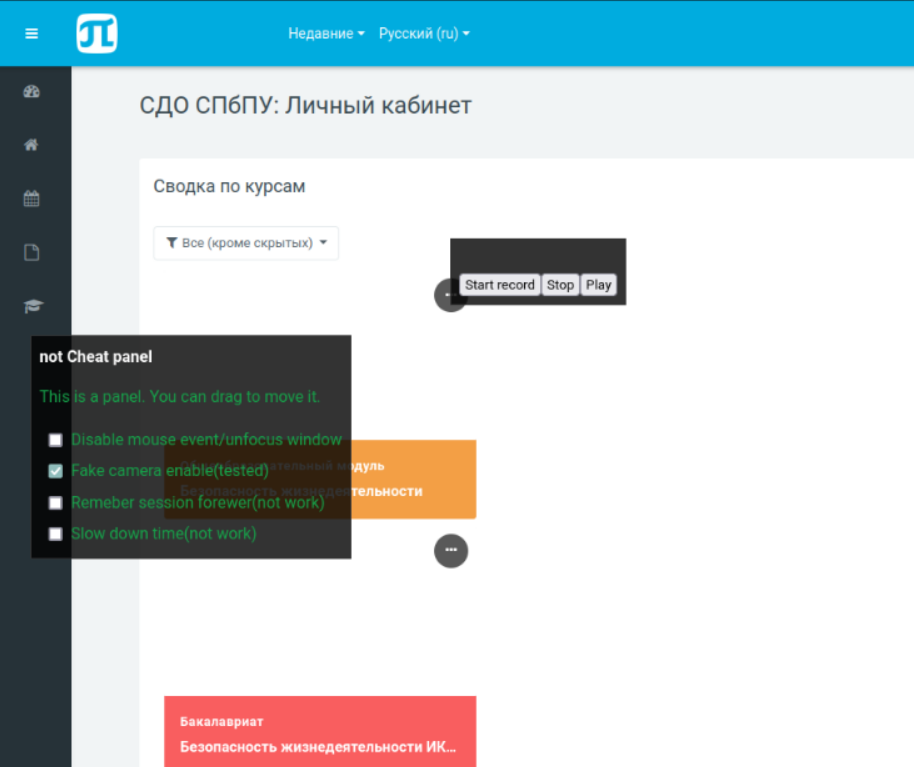

# bypass-proctoring-politech-site

This is a userscript initiated from [@violentmonkey/generator-userscript](https://github.com/violentmonkey/generator-userscript).

## Features
- Bypass event mouse and tabs, now u just open other tab and sip
- ThirdParty camera record and send to server not real video, bypass proctoring (beta)
- Save session forewer, disable poppup menu (disable)



## How to install?
U need exntension which can run custom script, here is a small list of similar ext:
- Violentmonkey (recommend)
- Greasemonkey
- Tampermonkey

Install one of list ext, and press link to [build](https://github.com/michael2to3/bypass-proctoring-politech-site/releases/download/Beta/index.user.js) release application and apply user script

## Development

``` sh
$ yarn dev
```

## Building

```sh
$ yarn build
```

## Lint

``` sh
$ yarn lint
```

## How to contribute?
All the information u need is [here](https://docs.github.com/en/get-started/exploring-projects-on-github/finding-ways-to-contribute-to-open-source-on-github)
